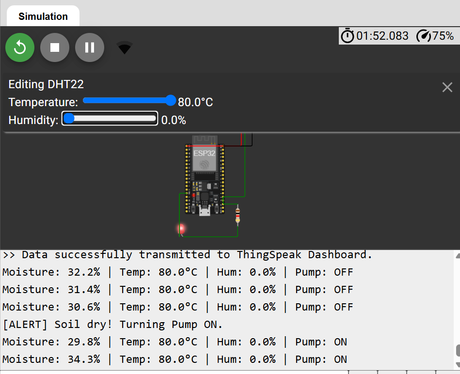
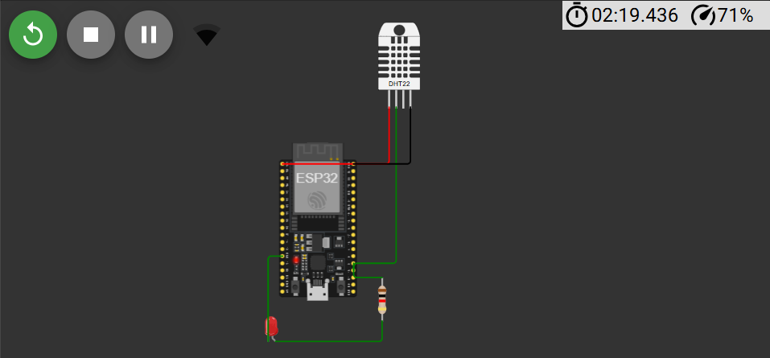
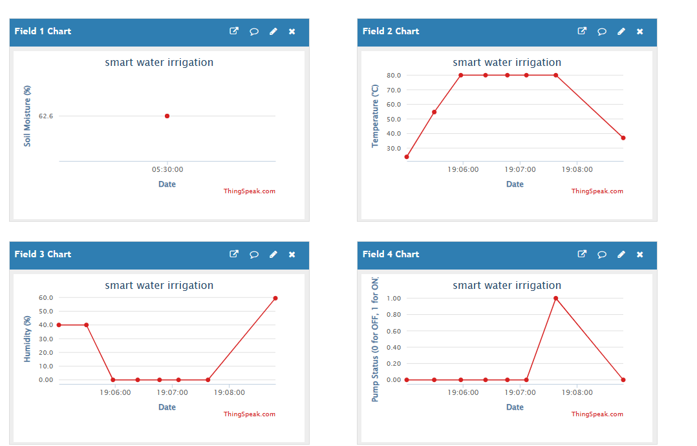

# IoT Smart Agriculture Monitoring System (ESP32)

A virtual Embedded Systems and IoT simulation that models an automated irrigation system. Built using an ESP32 microcontroller, this project simulates dynamic soil moisture evaporation and automated pump control, streaming real-time telemetry to a cloud dashboard.

##Features
* **Dynamic Moisture Simulation:** Algorithmic calculation of soil moisture based on simulated temperature and evaporation rates.
* **Automated Control Logic:** Hysteresis loop implementation (Pump activates at <30% moisture and deactivates at >80%).
* **Multi-Field Expansion:** Handles multiple environmental zones with independent drying rates.
* **Cloud Integration:** Real-time data logging and visualization using the ThingSpeak API.

## 🛠️ Tech Stack & Hardware (Virtual)
* **Microcontroller:** ESP32 (DevKit)
* **Sensors:** DHT22 (Temperature & Humidity)
* **Actuator:** Virtual Water Pump (LED indicator on GPIO 2)
* **Cloud Dashboard:** ThingSpeak
* **Simulation Environment:** Wokwi

## 📸 System Architecture & Dashboard

* **Figure 1:** Live execution of the control automation loop in Wokwi. The serial log demonstrates the dynamic hysteresis logic: when simulated soil moisture drops below the threshold value (30.0%), the automation triggers an alert (`[ALERT] Soil dry! Turning Pump ON`), flips the `pumpState` to active, and drives GPIO 2 high to illuminate the physical indicator LED.

* **Figure 2:** Hardware schematic and circuit architecture designed within the Wokwi simulation environment. The configuration interfaces an ESP32 microcontroller with a DHT22 environmental sensor over single-bus digital data pin GPIO 15, while managing a virtual water pump via a current-limited LED sub-circuit connected to GPIO 2.

* **Figure 3:** Real-time multi-field telemetry dashboard on the ThingSpeak Cloud IoT platform. The plots visualize synchronized data streams over a 24-hour window, capturing the immediate correlation between environmental changes (a manipulated spike to 80°C temperature / 0% humidity) and the automated activation of the irrigation system (Pump Status field spiking to binary high 1).

## ⚙️ How to Run the Simulation
1. Copy the `diagram.json` and `sketch.ino` files into a new [Wokwi ESP32 Project](https://wokwi.com/).
2. Ensure the `DHT sensor library` is added to the project via the Library Manager.
3. Replace the `TS_API_KEY` string in the code with your own ThingSpeak Write API Key.
4. Run the simulation and adjust the DHT22 temperature sliders to observe the dynamic evaporation and pump automation.
